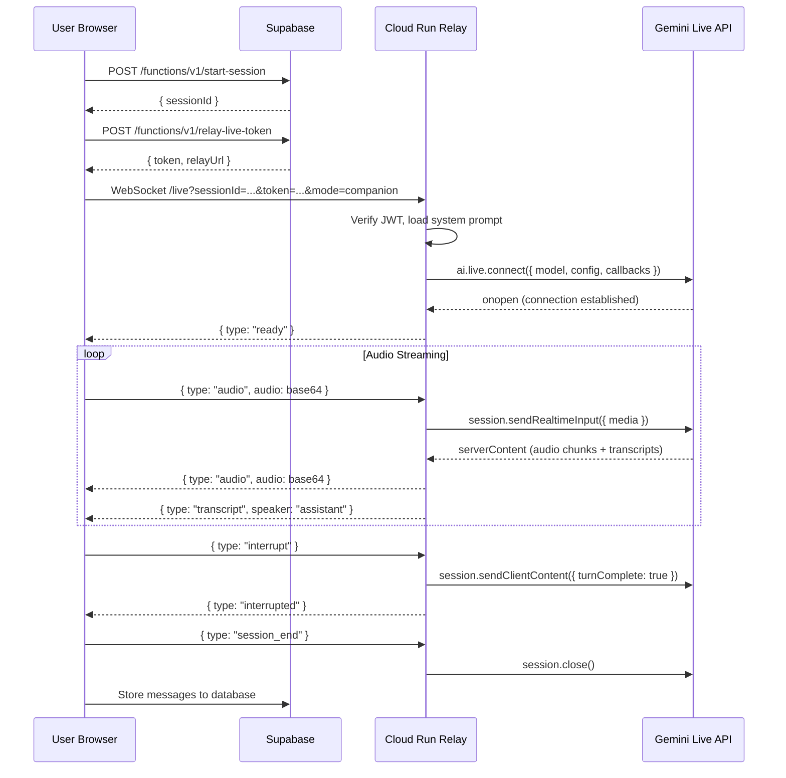
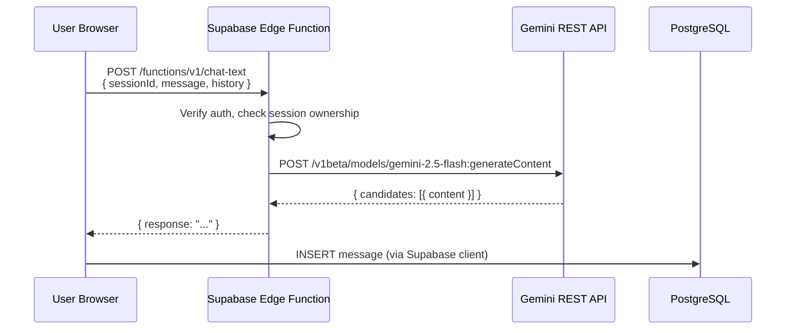
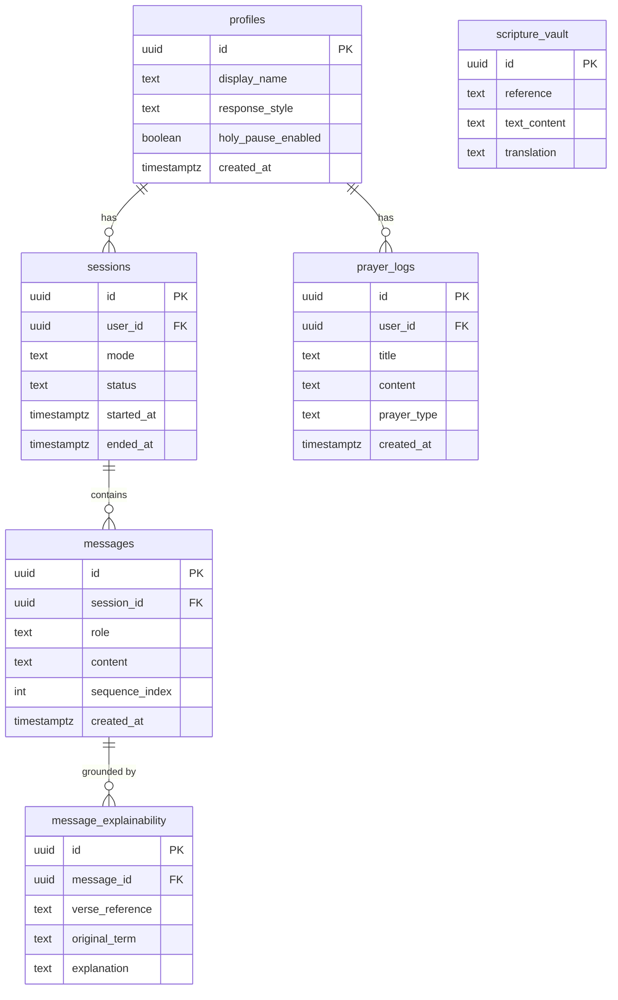

# Eliana — Architecture

## System Overview

```mermaid
graph TB
    subgraph Browser["Browser (React + Vite)"]
        UI[CompanionPage UI]
        MIC[MicPipeline<br/>AudioWorklet 16kHz PCM]
        PLAY[PlaybackQueue<br/>Web Audio API]
        LS[LiveService<br/>WebSocket Client]
        AUTH[AuthContext<br/>Supabase Auth]
    end

    subgraph Cloudflare["Cloudflare Pages"]
        STATIC[Static Assets<br/>React SPA]
    end

    subgraph GCP["Google Cloud Run"]
        RELAY[Relay Server<br/>Express + WS]
        SDK["@google/genai SDK<br/>live.connect()"]
        PROMPTS[System Prompts<br/>companion / bridge / tutor]
    end

    subgraph Google["Google AI"]
        GEMINI_LIVE["Gemini Live API<br/>gemini-2.5-flash-native-audio"]
        GEMINI_REST["Gemini REST API<br/>gemini-2.5-flash"]
    end

    subgraph Supabase["Supabase"]
        SUPA_AUTH[Auth<br/>JWT + OAuth]
        EDGE[Edge Functions]
        DB[(PostgreSQL<br/>RLS Enabled)]

        subgraph Functions["Edge Functions"]
            FN_TOKEN[relay-live-token]
            FN_CHAT[chat-text]
            FN_SESSION[start-session]
            FN_CONTEXT[get-session-context]
            FN_FALLBACK[safe-response-fallback]
        end
    end

    %% User flow
    UI --> AUTH
    AUTH --> SUPA_AUTH

    %% Live voice flow
    UI -->|1. Request token| FN_TOKEN
    FN_TOKEN -->|2. JWT + relay URL| UI
    UI -->|3. WebSocket connect| RELAY
    MIC -->|4. PCM audio chunks| LS
    LS -->|5. sendRealtimeInput| RELAY
    RELAY --> SDK
    SDK <-->|6. Bidirectional audio stream| GEMINI_LIVE
    SDK -->|7. Audio + transcripts| RELAY
    RELAY -->|8. Relay events| LS
    LS --> PLAY
    LS -->|9. Store transcripts| DB

    %% Text fallback flow
    UI -->|Text message| FN_CHAT
    FN_CHAT -->|generateContent| GEMINI_REST
    FN_CHAT -->|Store message| DB

    %% Session management
    UI --> FN_SESSION
    FN_SESSION --> DB
    UI --> FN_CONTEXT
    FN_CONTEXT --> DB

    %% Prompt loading
    RELAY --> PROMPTS

    %% Styling
    classDef browser fill:#1a1a2e,stroke:#c9a84c,color:#f5f0e8
    classDef cloud fill:#16213e,stroke:#c9a84c,color:#f5f0e8
    classDef google fill:#0f3460,stroke:#c9a84c,color:#f5f0e8
    classDef supabase fill:#1a1a2e,stroke:#3ecf8e,color:#f5f0e8
    classDef db fill:#0d1b2a,stroke:#3ecf8e,color:#f5f0e8

    class UI,MIC,PLAY,LS,AUTH browser
    class RELAY,SDK,PROMPTS cloud
    class GEMINI_LIVE,GEMINI_REST google
    class SUPA_AUTH,EDGE,FN_TOKEN,FN_CHAT,FN_SESSION,FN_CONTEXT,FN_FALLBACK supabase
    class DB db
```

## Live Voice Session Sequence

```mermaid
sequenceDiagram
    participant U as User Browser
    participant S as Supabase
    participant R as Cloud Run Relay
    participant G as Gemini Live API

    U->>S: POST /functions/v1/start-session
    S-->>U: { sessionId }

    U->>S: POST /functions/v1/relay-live-token
    S-->>U: { token, relayUrl }

    U->>R: WebSocket /live?sessionId=...&token=...&mode=companion
    R->>R: Verify JWT, load system prompt

    R->>G: ai.live.connect({ model, config, callbacks })
    G-->>R: onopen (connection established)
    R-->>U: { type: "ready" }

    loop Audio Streaming
        U->>R: { type: "audio", audio: base64 }
        R->>G: session.sendRealtimeInput({ media })
        G-->>R: serverContent (audio chunks + transcripts)
        R-->>U: { type: "audio", audio: base64 }
        R-->>U: { type: "transcript", speaker: "assistant" }
    end

    U->>R: { type: "interrupt" }
    R->>G: session.sendClientContent({ turnComplete: true })
    R-->>U: { type: "interrupted" }

    U->>R: { type: "session_end" }
    R->>G: session.close()
    U->>S: Store messages to database
```

## Text Chat Fallback Sequence

```mermaid
sequenceDiagram
    participant U as User Browser
    participant S as Supabase Edge Function
    participant G as Gemini REST API
    participant DB as PostgreSQL

    U->>S: POST /functions/v1/chat-text<br/>{ sessionId, message, history }
    S->>S: Verify auth, check session ownership
    S->>G: POST /v1beta/models/gemini-2.5-flash:generateContent
    G-->>S: { candidates: [{ content }] }
    S-->>U: { response: "..." }
    U->>DB: INSERT message (via Supabase client)
```

## Database Schema

```mermaid
erDiagram
    profiles {
        uuid id PK
        text display_name
        text response_style
        boolean holy_pause_enabled
        timestamptz created_at
    }

    sessions {
        uuid id PK
        uuid user_id FK
        text mode
        text status
        timestamptz started_at
        timestamptz ended_at
    }

    messages {
        uuid id PK
        uuid session_id FK
        text role
        text content
        int sequence_index
        timestamptz created_at
    }

    message_explainability {
        uuid id PK
        uuid message_id FK
        text verse_reference
        text original_term
        text explanation
    }

    scripture_vault {
        uuid id PK
        text reference
        text text_content
        text translation
    }

    prayer_logs {
        uuid id PK
        uuid user_id FK
        text title
        text content
        text prayer_type
        timestamptz created_at
    }

    profiles ||--o{ sessions : "has"
    profiles ||--o{ prayer_logs : "has"
    sessions ||--o{ messages : "contains"
    messages ||--o{ message_explainability : "grounded by"
```
